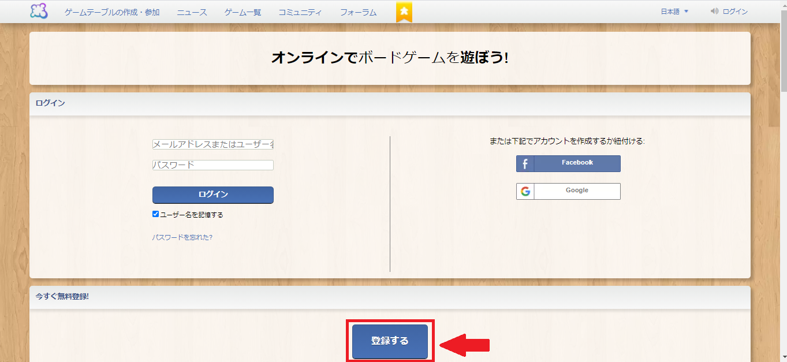
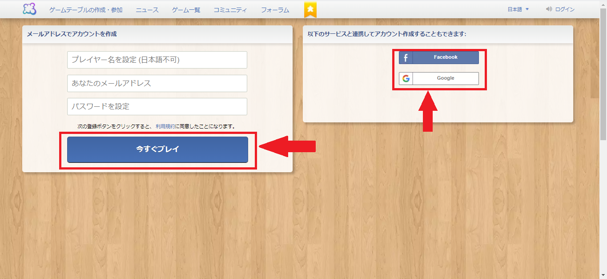

# 3月度レクリエーション

## オンラインボードゲームの始め方

### 1. アカウントを作成する

#### 1-1. サイトへアクセス

まずは『ボードゲームアリーナ』というサイトでアカウントの作成を行っていただきます。
下記のURLからサイトへアクセスしてください。

オンラインでボードゲームを遊ぼう! ・ Board Game Arena
https://ja.boardgamearena.com/welcome

#### 1-2. アカウント登録

トップ画面から『登録する』をクリックしてください。

